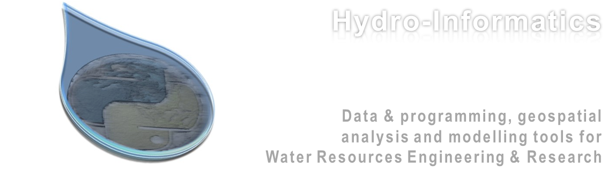

.. Hydro-Informatics documentation master file, created by
   sphinx-quickstart on Wed Mar 17 17:20:33 2021.
   You can adapt this file completely to your liking, but it should at least
   contain the root `toctree` directive.

====
Home
====

Large datasets, such as airborne imagery and hydro-meteorological datasets collected worldwide, drive progress in many disciplines. With traditional spreadsheet analysis tools, however, the large amounts of data can hardly be analyzed, understood, or used. The courses supported with this website aid hydraulic engineers, geomorphologists, river ecologists, and any water resources related challenge with tools for efficient data analyses and presentation. The methods described rely on open-access tools to leverage international and interdisciplinary collaboration on all levels.

.. note::
  The term hydroinformatics (or hydro-informatics) is widely used in relation to the field of hydrology.

  Yet, the syllable *hydro* goes back to the Greek word for *water*. In this light the term *hydro-informatics* as used on this website also refers to water, but primarily in the field of hydraulic engineering with its links to ecohydraulics, geomorphology, geo-informatics, and hydrology.

Find your course in the `Classroom <../lectures/classroom.html>`__ chapter (`lectures and exercises <../lectures/lectures.html>`__) and take a seat.

The *Get started* chapter represents a summary of provide systematic workflows to setup your computer for: - coding with `Python Anaconda <../get-started/ide.html>`__ - code documentation with `markdown <../get-started/documentation.html>`__ - version control with `git <../get-started/git.html>`__ - geospatial analyses with `desktop applications <../get-started/geo.html>`__ such as *QGIS* - using `auxiliary tools and open-source/access alternatives <../get-started/others.html>`__ to
proprietary software such as *GNU Octave* (similar to *Matlab*) or *Libre Office* (similar to MS Office)

The *Python* chapters provide: - a general introduction to *Python* programming and object orientation (`basics <../python-basics/python.html>`__); - an overview of `geospatial data and analyses with
Python <geo-python.html>`__.

The numerical modelling chapter provides complete workflows for getting started with two-dimensional (2D) hydrodynamic models: - `ETH Zurich\ ’s BASEMENT <../numerics/basement.html>`__ software - More in the future.

The `Troubleshooting <../toubleshoot/dbg_anaconda.html>`__ chapter includes information about how to debug known issues (not that issues ever existed…).

* :ref:`genindex`
* :ref:`modindex`
* :ref:`search`
